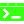

# Welcome to our Project!

## 📊 Quick facts

### Project based on 
- MyCrew Project

### Technologies

 

### Trainer
- [🐱](https://github.com/anaaragon88)

### Team
- [🙈](https://github.com/gabrielml)
- [🦦](https://github.com/Ivanlr96)
- [🐧](https://github.com/jemb4)
- [🐬](https://github.com/sara-vazquez)

## ℹ️ About 

This project is part of the [Full Stack Web Development training program](https://factoriaf5.org/aprende/desarrollo-web-full-stack-asturias/) in [Asturias](https://www.britannica.com/place/Asturias-region-Spain), offered by [Factoría F5](https://factoriaf5.org/).

The curriculum covers a wide range of topics, from basic programming languages ​​and UX principles to advanced project development techniques. It includes front-end and back-end technologies, agile methodologies, and tools for user experience design and database development. The program also focuses on essential soft skills such as communication, problem-solving, teamwork, adaptability, and time management.